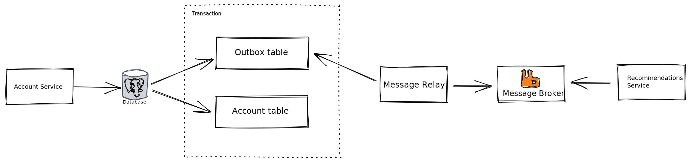

# Django outbox example 👋

> An example of the Transactional Outbox pattern.
  
## ⚙️ Architecture



## 🚀 Run

```bash
$ docker-compose up
```
## 🔨 Libs

[django-stomp](https://github.com/juntossomosmais/django-stomp)

## 📚 References

[Outbox Pattern.](https://medium.com/@victorhsr/microservices-outbox-pattern-a4344d8ed0b)

[Transactional Outbox: What is it and why you need it?](http://morningcoffee.io/what-is-a-transaction-outbox-and-why-you-need-it.html)